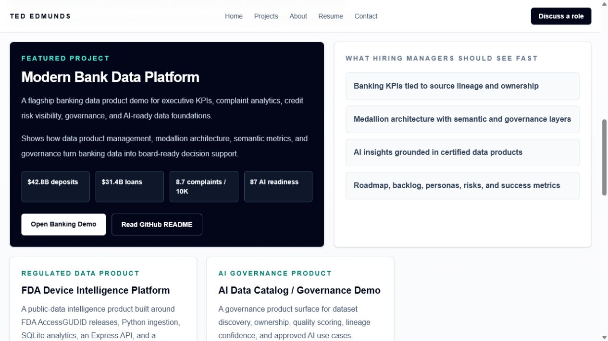
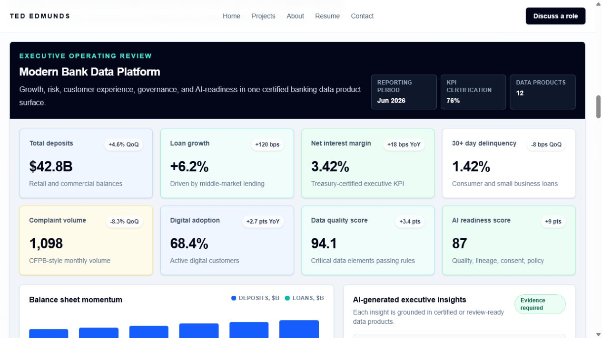
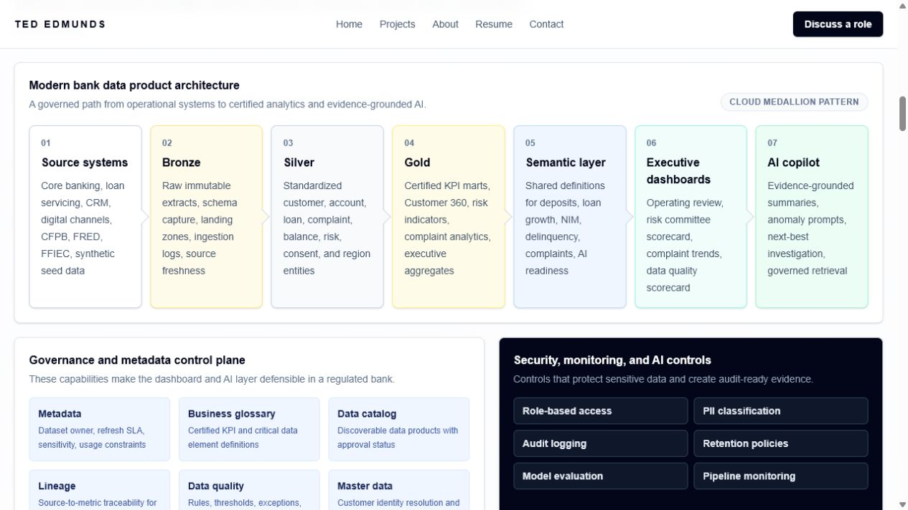
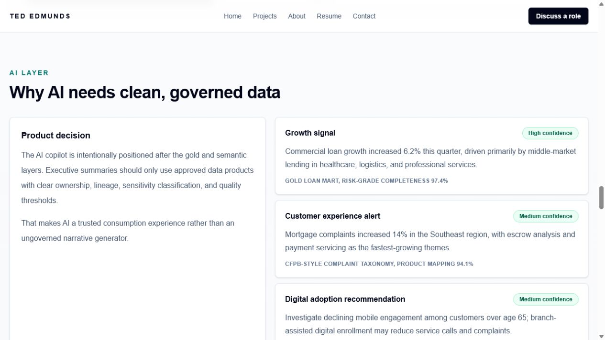
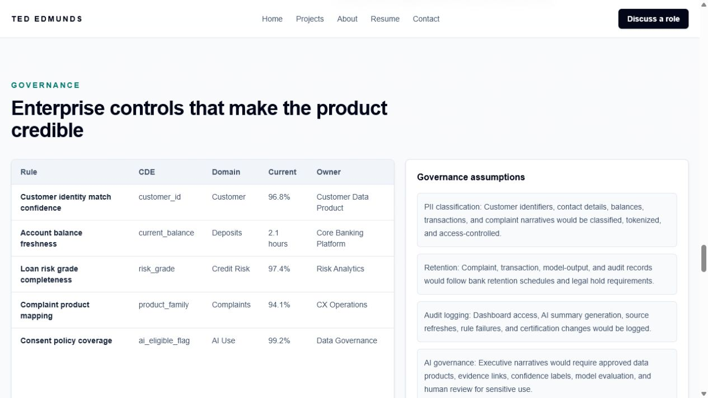

# Modern Bank Data Platform


Executive-quality banking data product demo for data product management, governance, cloud data architecture, AI-ready data foundations, and executive analytics.

This project is part of the portfolio site and lives at:

`app/projects/banking-data-platform`

## Portfolio Value

Hiring managers should be able to review this project in two or three minutes and see evidence of:

- Enterprise data platform thinking
- Data product management judgment
- Banking analytics fluency
- Governance and metadata design
- Executive reporting and KPI storytelling
- AI readiness grounded in trusted data
- Practical tradeoffs for GitHub and Vercel deployment

## Screenshots

Screenshots are saved under `public/modern-bank-data-platform/screenshots/`.











## What This Project Is

Modern Bank Data Platform is a public-safe banking data product case study. It shows how a regional or national bank could move from fragmented operational systems to certified executive KPIs, governed AI insights, and a reusable data product operating model.

The demo includes:

- Executive banking KPI dashboard
- Deposit, loan, complaint, risk, digital adoption, quality, and AI readiness metrics
- Medallion architecture: source systems, bronze, silver, gold, semantic layer, dashboards, AI copilot
- Governance controls: glossary, owners, stewards, CDEs, lineage, quality, PII, retention, audit logging
- Product artifacts: personas, roadmap, backlog, acceptance criteria, success metrics, tradeoffs, risks
- AI executive outputs grounded in certified data products

## Why This Matters to Banks

Banks do not just need more dashboards. They need reusable data products with clear definitions, trusted lineage, quality rules, ownership, access controls, and audit evidence. Without that foundation, executive reporting becomes inconsistent and AI pilots produce narratives that are hard to defend.

This demo frames the platform as a product capability:

1. Business leaders get certified metrics they can use in operating reviews.
2. Data leaders get visible quality, lineage, ownership, and remediation signals.
3. Risk and compliance teams get evidence for complaint, credit, retention, and AI governance.
4. AI teams get approved data products with confidence labels and policy boundaries.

## Architecture

The reference architecture follows a modern cloud data pattern:

1. Source systems: core banking, loan servicing, CRM, digital channels, CFPB, FRED, FFIEC, and synthetic seed data.
2. Bronze: raw immutable extracts, landing zones, schema capture, and ingestion audit logs.
3. Silver: standardized customers, accounts, loans, complaints, balances, risk grades, and consent attributes.
4. Gold: certified KPI marts, Customer 360, complaint analytics, risk indicators, and executive aggregates.
5. Semantic layer: governed definitions for deposits, loan growth, NIM, complaints, delinquencies, and AI readiness.
6. Executive dashboards: operating review, risk committee scorecards, complaint trends, and quality scorecards.
7. AI copilot: evidence-grounded summaries, anomaly prompts, next-best investigation, and governed retrieval.

Cross-cutting controls include metadata, business glossary, catalog certification, lineage, data quality, master data, role-based access, audit logging, retention, monitoring, and model evaluation.

## Features

- Flagship portfolio project card on the homepage
- Dedicated consulting-style case study page
- Polished executive dashboard UI
- Architecture diagram styled for enterprise audiences
- AI-generated executive insight examples with confidence and evidence
- Governance section with critical data elements, owners, stewards, and reasons each rule matters
- Product management artifacts that resemble enterprise delivery work
- GitHub/Vercel-friendly static implementation

## Technology Stack

- Next.js App Router
- TypeScript
- Tailwind CSS
- Static synthetic data module
- Reusable React components for charts, tables, metrics, dashboard, and architecture
- No backend dependency for the portfolio demo

Primary files:

- `app/projects/banking-data-platform/page.tsx`
- `components/BankingDashboard.tsx`
- `components/BankArchitectureDiagram.tsx`
- `data/modernBankData.ts`
- `public/modern-bank-data-platform/sample-data.json`

## Data Sources

The deployed portfolio uses public-safe synthetic data. Real data could plug into the same design:

- CFPB Consumer Complaint Database for complaint themes, product categories, response timeliness, and severity.
- FRED economic indicators for rate environment, unemployment, inflation, and macro context.
- FFIEC Call Report data for peer benchmark ratios, deposits, loan categories, and regulatory context.
- Synthetic banking data for customers, accounts, loans, transactions, segments, risk grades, and governance signals.

No private customer, account, transaction, institution, credential, or sensitive data is included.

## Product Decisions and Tradeoffs

- Static seed data keeps the portfolio fast, reliable, and safe for public deployment.
- The dashboard emphasizes executive operating decisions over transaction-level drill-down.
- Quality, lineage, ownership, and certification are visible in the UI because trust is part of the product experience.
- AI appears after the governed gold and semantic layers to reinforce that clean data is the foundation for reliable AI outputs.
- Public data connectors are documented as integration points rather than required runtime dependencies.

## Lessons Learned

- Executive dashboards are more credible when metric definitions, owners, and exceptions are visible.
- AI readiness is a data product outcome, not a model feature.
- Complaint analytics becomes more valuable when joined to product, region, segment, and operational ownership.
- Portfolio projects should show business judgment and implementation tradeoffs, not only architecture diagrams.

## Local Setup

```bash
npm install
npm run dev
```

Open:

`http://localhost:3000/projects/banking-data-platform`

## Build

```bash
npm run build
```

## Deploy

This project works with standard Vercel deployment:

1. Push the portfolio repository to GitHub.
2. Import the repository in Vercel.
3. Keep the framework preset as Next.js.
4. Use `npm install` and `npm run build`.
5. Deploy.

No secrets are required for the static demo. Any future live integration should store API keys, database credentials, and ingestion secrets in managed environment variables or cloud secret stores.

## Future Enhancements

- CFPB complaint CSV/API ingestion and static snapshot export
- FRED macro overlay for rate and unemployment context
- FFIEC peer benchmark extract if feasible for public deployment
- Synthetic transaction generator with fraud, complaint, and delinquency scenarios
- Downloadable product brief and data dictionary
- AI evaluation logs and model-output review workflow
- Role-specific dashboard filters for CFO, CDO, risk, and digital banking leaders
